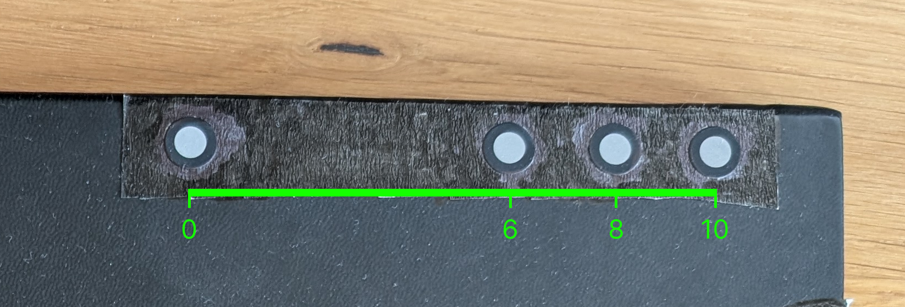

# Pupil Labs IR Plane Tracker

[](https://github.com/pupil-labs/pl-ir-plane-tracker/actions/workflows/main.yml)
[](https://pupil-labs.github.io/pl-ir-plane-tracker/)
[](https://github.com/astral-sh/uv)
[](https://github.com/astral-sh/ruff)
[](https://github.com/pre-commit/pre-commit)
[](https://pypi.org/project/pupil-labs-ir-plane-tracker/)
[](https://pypi.org/project/pupil-labs-ir-plane-tracker/)

> [!IMPORTANT]
> This package is a work in progress. Use at your own risk!
> The API may change without warning, the computational performance is not optimized, and the tracking performance may lack in some cases.

This repository implements a plane tracking algorithm based on retroreflective IR markers. The markers need to be placed on the boundary of the plane of interest in a known pattern. The camera needs to be an IR camera with IR illuminators placed around the lense.

Any circular retroreflective marker with a diameter of around 10 mm should work. The ones we used for testing are [these](https://www.amazon.de/-/en/dp/B0DSJ54GRH).

The IR camera with IR illuminators we have used for testing is [this one](https://www.amazon.de/dp/B07C1JHB6K).

## Input Parameters

The IR markers need to be placed in groups of four in specific intervals to form a feature line. The intervals are defined by the `norm_line_points` parameter. By default they are placed on a 10 cm long line at steps `[0, 6, 8, 10]` cm. The intervals can be adjusted to fit the size of the plane better. It is recommended to keep the relative distances between the points the same and only scale them up or down linearly.



A total of 6 such feature lines should be placed along the boundary of the plane to be tracked as shown in the image below. Note that the orientation of the feature lines matters.

The exact position of the line on the plane boundary does not matter, but it has to be documented as an input parameter via the various `*_margin` parameters.

The width and height of the screen also need to be specified.


Lastly, the resolution of the camera image needs to be specified via the `img_size_factor` parameter, which expresses the resolution as a multiple of the base resolution of 640x480 pixels. For example, if the camera image is 1280x960 pixels, the `img_size_factor` should be set to 2.0.

## Installation

```bash
pip install -e git+https://github.com/pupil-labs/pl-ir-plane-tracker.git
```
