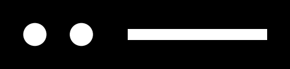

# Pupil Labs IR Plane Tracker

[](https://github.com/pupil-labs/pl-ir-plane-tracker/actions/workflows/main.yml)
[](https://pupil-labs.github.io/pl-ir-plane-tracker/)
[](https://github.com/astral-sh/uv)
[](https://github.com/astral-sh/ruff)
[](https://github.com/pre-commit/pre-commit)
[](https://pypi.org/project/pupil-labs-ir-plane-tracker/)
[](https://pypi.org/project/pupil-labs-ir-plane-tracker/)

> [!IMPORTANT]
> This package is a work in progress. Use at your own risk!
> The API may change without warning, the computational performance is not optimized, and the tracking performance may lack in some cases.

This repository implements a marker-based plane tracking algorithm that is in particular suited for screen tracking.

Ideally, the camera is an IR camera with the markers made from a retroreflective material, but a regular RGB camera with black-and-white markers also works to some extent.

# Quick Start

## Installation

To install the package and its dependencies, run the following commands:

```bash
git clone git@github.com:pupil-labs/ir_plane_tracker.git
cd ir_plane_tracker/

uv sync --extra examples
# alternatively via pip:
# pip install .[examples]
```

## Example Applications

The project contains an example application that demonstrates gaze mapping onto a screen. For convenience, the markers are displayed by the app on the screen, which allows to determine their position on the screen automatically. Thus, running this example requires no setup.

Run the example using the following command, providing the IP of a Neon device on your network as an argument:

```bash
cd examples/

python gaze_mapping_app_main.py --params_path resources/params.json --neon_ip <NEON_IP_ADDRESS>
```

Note, you can find the IP of your Neon device from the Neon Companion app when you open the network panel by clicking the icon in the top right corner of the home screen.

## Marker Display

A minimal example that simply displays the markers on the screen is available in the `examples/feature_display_app.py` file. You can run it using the following command:

```bash
cd examples/
python feature_display_app.py --params_path resources/params.json
```

# Marker Placement

For the algorithm to work, markers need to be placed around the boundary of the rectangular plane of interest (one marker per boundary). The markers need to be co-planar with the plane and parallel to the boundaries. To optimize visibility and occlusion resistence, the markers are ideally placed close to the center of their respective boundary.

The markers may be placed inside or outside of the plane of interest. If the plane is a screen, the markers may be displayed on the screen out of convenience. In many cases, it is preferable to place the markers outside of the plane of interest, to avoid occlusion of the plane's content by the markers.

The exact position of the markers has to be specified as part of the input parameters.

## Using Printed Markers

You can print [this PDF](https://github.com/pupil-labs/ir_plane_tracker/blob/main/features-A4.pdf) on a DIN A4 sheet of paper to get markers in the right size for typical screen tracking setups. If the viewing distance is larger than ~1 meter, you will have to use larger markers (see [TODO]()).

You have to measure the position of each marker in realtion to the plane and specify it as an input parameter (in the `params.json` file). The needed parameters are `top_pos`, `bot_pos`, `left_pos`, and `right_pos` which describe the position of the marker on the respective boundary.

The orientation of the marker also matters and should follow what is visible in the example below.

A markers position is defined by the position of the outter circular feature. The origin of the plane coordinate system is the top left corner.


If your target plane is a screen, you may use the the app available in `examples/ruler_app_main.py` to display rulers on the screen to help with measuring the marker positions.

In addition to the marker positions, you also need to specify the size of the plane in the `params.json` file using the `plane_width` and `plane_height` parameters.

## Displaying Markers on Screen

If your target plane is a screen, you may also display the markers on the screen itself. This has the downside of occluding some of the screen area, but is convenient as it allows to determine the marker positions automatically.

The repository contains an [exemplary PySide6 widget](https://github.com/pupil-labs/ir_plane_tracker/blob/main/src/pupil_labs/ir_plane_tracker/feature_overlay.py) that displays the markers in the correct size and contains functionality to retrieve their positions in screen coordinates as well as the size of the screen.

It's usage is demonstrated in the `examples/gaze_mapping_app_main.py` example application and a more minimal example in the `examples/feature_display_app.py` file.

Alternatively, you can also display the markers and determine the input parameters manually. An image of the marker is available [here](https://github.com/pupil-labs/ir_plane_tracker/blob/main/feature.png).


